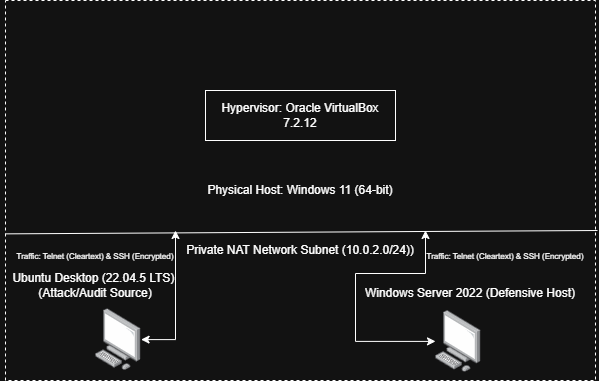
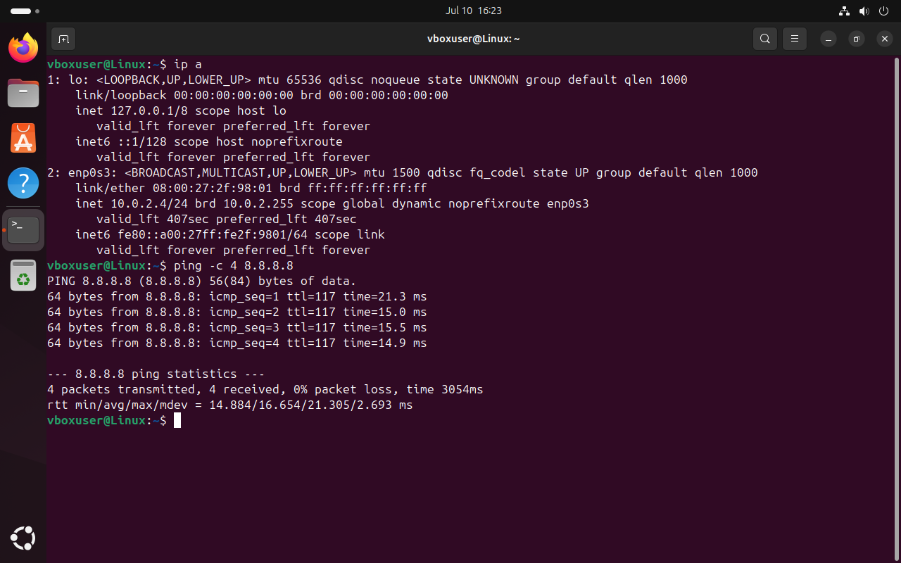
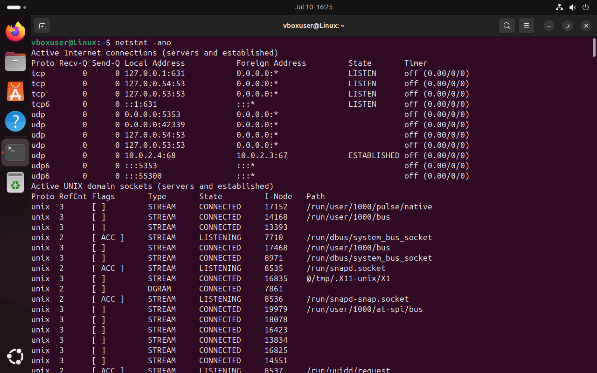
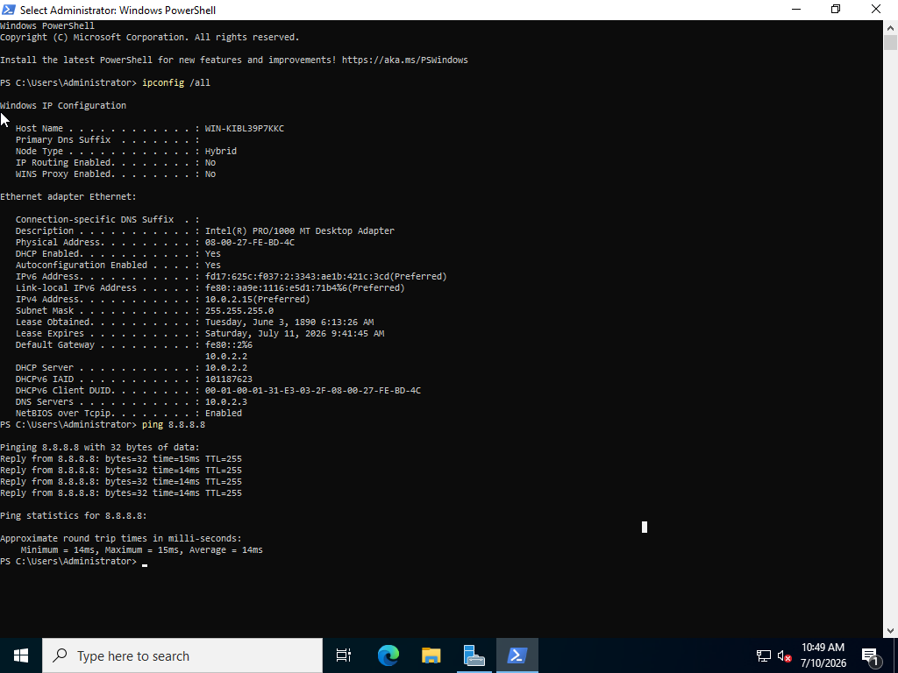
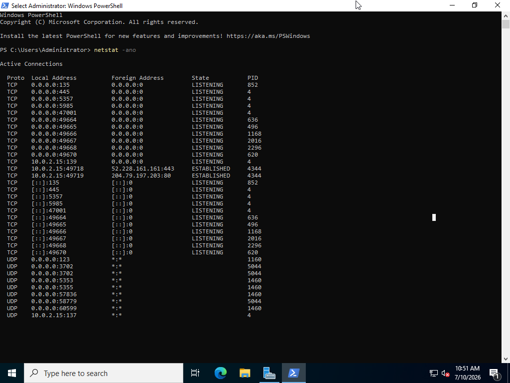

# SOC-Analyst-Home-Lab
Isolated local virtualization laboratory for security analysis.

# Local Defensive Security Laboratory Setup
By Alexander Kern

## Executive Summary
This repository contains my active home lab environment used to test host security, analyze network traffic, and practice command-line diagnostics.

## Architecture Specifications
* Hypervisor: Oracle VirtualBox 7.2.12
* Host Operating System: Windows 11 (64-bit)
* Linux Terminal (Attack/Audit Source): Ubuntu Desktop (22.04.5 LTS)
* Target Windows Server (Defensive Host): Windows Server 2022
* Networking Profile: Private NAT Network Subnet (10.0.2.0/24)

## Structural Exercises Documented
1. Private network configuration and host connection tracking.
2. Administrative command analysis via netstat, tasklist, and ipconfig.
3. Plaintext payload extraction: Wireshark packet capture analysis comparing Telnet cleartext to encrypted SSH streams.
   
---

Command-Line Analysis & Network Sockets

1. Active Diagnostic Environmental Baselines

Ubuntu Linux Terminal Environment
Interface & Ping Diagnostics (`ip a` & `ping -c 4 8.8.8.8`):
  
* **Active Sockets Baseline (`netstat -ano`):**
  

## Windows Server 2022 Terminal Environment
* **Interface & Ping Diagnostics (`ipconfig /all` & `ping 8.8.8.8`):**
  
* **Active Sockets Baseline (`netstat -ano`):**
  

---

### 2. Technical Concepts & Triage Analysis

## What is a Network Socket?
A network socket is basically an internal connection endpoint that the operating system uses to send and receive data over a network. 
It is created by combining an IP Address with a Port Number (like `10.0.2.4:22` or `10.0.2.15:80`). 
The IP address gets the data packet to the right machine on the network, and the port number makes sure that 
the data gets handed off to the exact application or service waiting for it in memory.

## Tracking Suspicious PIDs Using Native Utilities
When looking at network traffic in a SOC environment, an analyst needs a way to connect network activity back to the actual software running on a computer to catch unauthorized activity or malware:

1. Finding the Connection: Running `netstat -ano` lets you see a live list of every open port and active connection on the system. 
2. Finding the PID: Adding the `-o` flag is critical because it tells the OS to show the Process ID (PID) for each connection. This number acts as the direct link between network traffic and the system process responsible for it.
3. Identifying the Program: 
   * On Windows, you take that PID and run `tasklist` in the command line to see the name of the executable file running it.
   * On Linux, you can run `ps -p [PID]` to see the exact program path. 

This tracking process allows an analyst to look at an unrecognized connection, find the PID, and immediately verify if it belongs to a legitimate system tool or a malicious program hiding on the machine.
## Process Resolution:

   * On Windows, running `tasklist` resolves the target identification number to its parent executable name, which helps catch malicious programs masquerading in temporary directories.
   * On Linux, querying `ps -p [PID]` unmasks the binary origin path, allowing an analyst to verify if a socket belongs to an approved system daemon or an unauthorized process.

## Note on Service Management: Practiced starting, inspecting, and terminating native local services programmatically via `systemctl` on Linux and `Stop-Service` / `Get-Service`
on Windows Server to simulate service-layer incident response.
