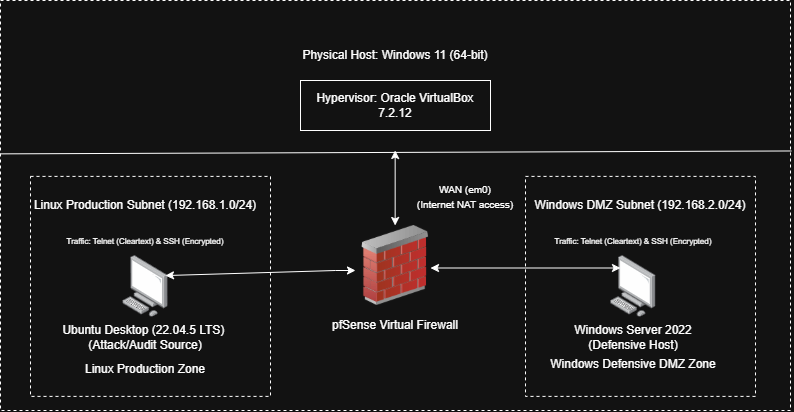
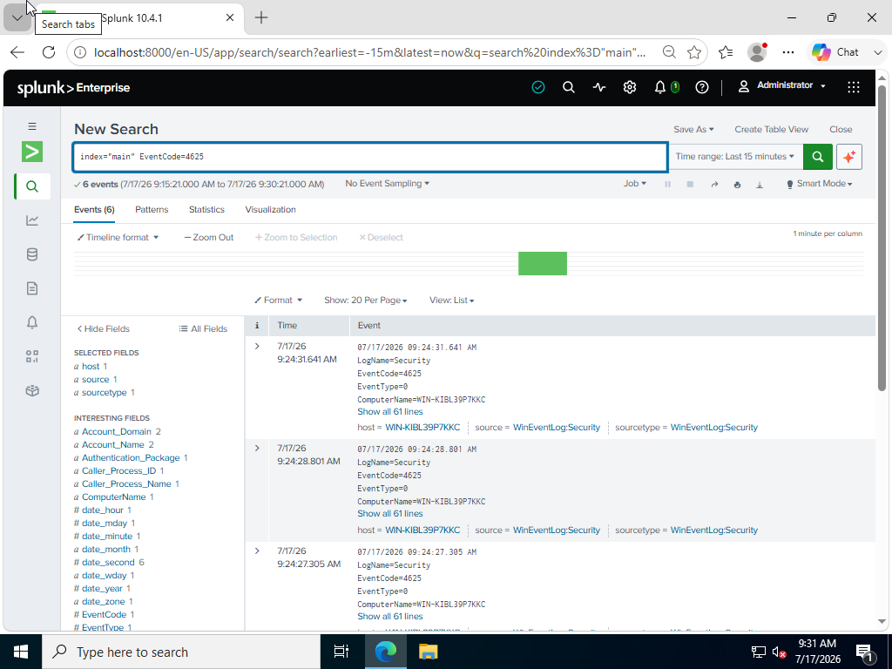
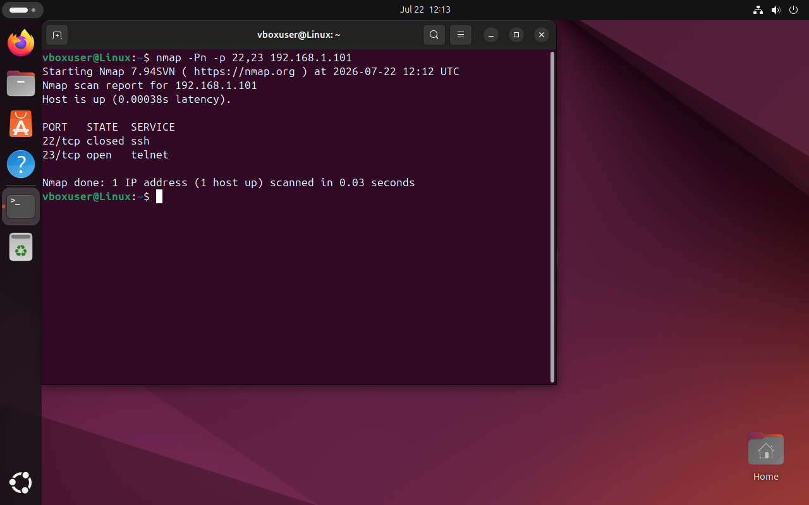
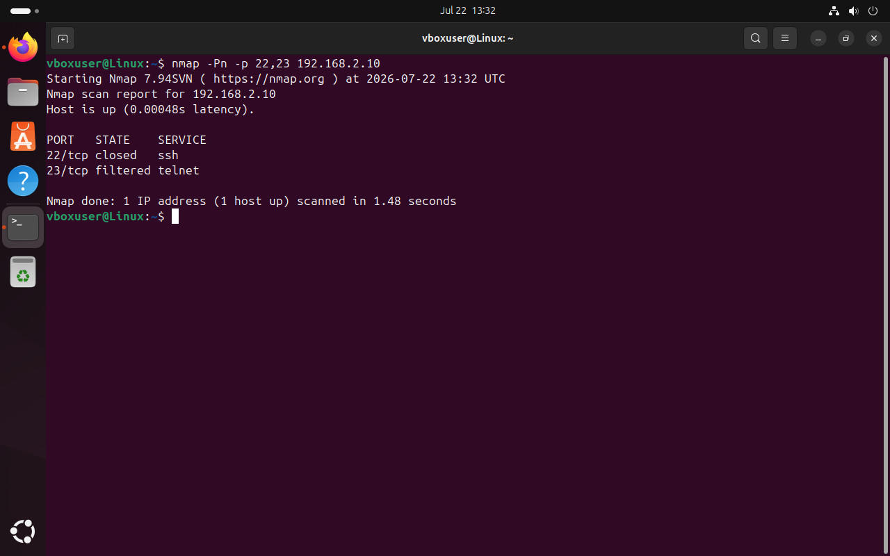

# SOC-Analyst-Home-Lab
Isolated local virtualization laboratory for security analysis.


# Local Defensive Security Laboratory Setup
By Alexander Kern

## Executive Summary
This repository contains my active home lab environment used to test host security, analyze network traffic, and practice command-line diagnostics.

### Architecture Specifications
- **Hypervisor:** Oracle VirtualBox 7.2.12
- **Host Operating System:** Windows 11 (64-bit)
- **Virtual Firewall:** pfSense Community Edition (CE)
- **Linux Production Host (Audit/Attack Source):** Ubuntu Desktop (22.04.5 LTS) — `192.168.1.100/24`
- **Windows DMZ Host (Defensive Target & SIEM):** Windows Server 2022 — `192.168.2.10/24`
- **Networking Profile:** Multi-Zone Segmented Architecture (pfSense Routed Gateway)
  - WAN (em0): Upstream VirtualBox NAT
  - LAN (em1): Linux Production Zone (`192.168.1.0/24`, Gateway: `192.168.1.1`)
  - OPT1 (em2): Windows Defensive DMZ (`192.168.2.0/24`, Gateway: `192.168.2.1`)

> **Note:** Early diagnostic screenshots in this repo (Section 2) were captured during the initial flat-network phase, before pfSense segmentation was introduced in Section 5. IP addressing changed from the original `10.0.2.x` range to `192.168.1.x` / `192.168.2.x` once the segmented topology was deployed.



## Structural Exercises Documented
1. Private network configuration and host connection tracking.
2. Administrative command analysis via netstat, tasklist, and ipconfig.
3. Plaintext payload extraction: Wireshark packet capture analysis comparing Telnet cleartext to encrypted SSH streams.
   
---

Command-Line Analysis & Network Sockets

1. Active Diagnostic Environmental Baselines

Ubuntu Linux Terminal Environment
Interface & Ping Diagnostics (`ip a` & `ping -c 4 8.8.8.8`):
  
* **Active Sockets Baseline (`netstat -ano`):**
  

## Windows Server 2022 Terminal Environment
* **Interface & Ping Diagnostics (`ipconfig /all` & `ping 8.8.8.8`):**
  
* **Active Sockets Baseline (`netstat -ano`):**
  

---

### 2. Technical Concepts & Triage Analysis

## What is a Network Socket?
A network socket is basically an internal connection endpoint that the operating system uses to send and receive data over a network. 
It is created by combining an IP Address with a Port Number (like `10.0.2.4:22` or `10.0.2.15:80`). 
The IP address gets the data packet to the right machine on the network, and the port number makes sure that 
the data gets handed off to the exact application or service waiting for it in memory.

## Tracking Suspicious PIDs Using Native Utilities
When looking at network traffic in a SOC environment, an analyst needs a way to connect network activity back to the actual software running on a computer to catch unauthorized activity or malware:

1. Finding the Connection: Running `netstat -ano` lets you see a live list of every open port and active connection on the system. 
2. Finding the PID: Adding the `-o` flag is critical because it tells the OS to show the Process ID (PID) for each connection. This number acts as the direct link between network traffic and the system process responsible for it.
3. Identifying the Program: 
   * On Windows, you take that PID and run `tasklist` in the command line to see the name of the executable file running it.
   * On Linux, you can run `ps -p [PID]` to see the exact program path. 

This tracking process allows an analyst to look at an unrecognized connection, find the PID, and immediately verify if it belongs to a legitimate system tool or a malicious program hiding on the machine.
## Process Resolution:

   * On Windows, running `tasklist` resolves the target identification number to its parent executable name, which helps catch malicious programs masquerading in temporary directories.
   * On Linux, querying `ps -p [PID]` unmasks the binary origin path, allowing an analyst to verify if a socket belongs to an approved system daemon or an unauthorized process.

### 3. Note on Service Management
Practiced starting, inspecting, and terminating native local services programmatically via `systemctl` on Linux and `Stop-Service` / `Get-Service` on Windows Server to simulate service-layer incident response.

## 4. SIEM Operations: Log Ingestion & Query-Driven Event Triage

### Objective
To move beyond isolated host analysis, I deployed **Splunk Enterprise** on my Windows Server VM to act as my central SIEM platform. The goal was to build a local log ingestion pipeline, simulate a credential brute-force attack, and use Splunk's Search Processing Language (SPL) to reconstruct the event timeline.

### Log Ingestion Architecture
Setting up the data input actually tripped me up more than I expected. I went into Splunk's **Settings > Data Inputs** looking for local event log collection, and my first instinct was to click into **Forwarded Inputs** and click on Windows Event Logs, since that sounded the most like what I wanted to look at in the list. That's meant for receiving logs shipped over from other Splunk forwarders though, not for pulling logs off the local machine itself, so nothing showed up when I tried to configure it that way. After poking around for a bit I found the right section under **Local Inputs > Local Event Log Collections**, which is what actually lets Splunk read straight from the Windows Event Log service on the same box.

Once that was sorted, the setup was simple:
- **Monitored Logs:** Windows `Security` and `System` channels
- **Storage Destination:** Splunk's default index (`index="main"`)

Since this is a standalone VM with no forwarders in the environment, everything stays local, no distributed collection needed:

```text
+-----------------------+      Local Event Ingestion      +----------------------------+
|  Windows Server 2022  | ------------------------------> |     Splunk Enterprise      |
|  Security Event Logs  |     (Local Event Collection)    | (Local Dashboard Port 8000) |
+-----------------------+                                 +----------------------------+
```

### Attack Simulation
To generate some real telemetry to chase down, I locked the Windows Server VM and ran a simulated brute-force attempt, with 6 consecutive failed logins at the lock screen using random passwords, just to throw some noise into the security logs.

### Event Triage & SPL Analysis
After logging back in, I opened up Splunk's Search and Reporting app and started digging.

**Step 1: Isolating the failed logins**

I searched for EventCode 4625 (failed Windows logins) to pull the attack footprint out of the noise:

```spl
index="main" EventCode=4625
```



This filtered down to a tight cluster of failures, all within about a minute — targeting the `Administrator` account, from the local workstation, with timestamps lining up exactly with when I ran the simulation.

**Step 2: Checking whether it actually got in**

Next question was obvious: did any of those attempts succeed? I pivoted the query to EventCode 4624 (successful logins) over the same time window:

```spl
index="main" EventCode=4624
```

Nothing came back for `Administrator` during that window, so the attack failed to get through, which is what I wanted to confirm.

### Takeaways
Getting the data input wrong at first was honestly a useful mistake. It made me actually understand the difference between forwarded and local inputs instead of just following a checklist. Beyond that, this lab made it clear why SOCs lean so heavily on centralized logging: instead of scrolling through Event Viewer on individual boxes, everything lands in one searchable place. And once I had the query working, it wasn't hard to see how something like this would get turned into a real alert — flag anything with 5+ failed logins in 30 seconds and auto-isolate the host.

---

## 5. Enterprise Perimeter Defense: pfSense Firewall & Network Segmentation

### Objective
To eliminate the single flat subnet limitation and introduce enterprise-grade perimeter control, I deployed a **pfSense Community Edition (CE)** virtual firewall. This upgrade transitions the lab from an unmonitored local switch layout into a routed, segmented multi-zone environment with boundary controls.

### Infrastructure & Topology Evolution

In the baseline lab, all virtual machines sat on one flat subnet with no transit filtering or boundary policy in place. To simulate an enterprise setup, I brought in pfSense as a multi-homed gateway and split the environment into three zones:

1. **WAN Zone (`em0`):** Connected via VirtualBox NAT to provide controlled upstream Internet access and package retrieval.
2. **Linux Production Zone (`em1` - `192.168.1.0/24`):** Isolated internal network hosting the Ubuntu Desktop (Attack/Audit Source). Default gateway set to `192.168.1.1`.
3. **Windows Defensive DMZ Zone (`em2` - `192.168.2.0/24`):** Isolated internal network hosting the Windows Server 2022 target host and Splunk SIEM deployment. Default gateway set to `192.168.2.1`.


### pfSense Deployment & Interface Mapping

This is where I hit my first real "oh, that's why" moment of the lab. In the old flat-network setup, boot order never mattered, so I just started whatever VM I felt like. With pfSense in the mix that habit bit me. If Windows Server or Ubuntu came up before pfSense was actually routing, they'd either fail to grab an IP or hang onto a stale lease from the old flat network. I'd log into Windows Server, run `ipconfig`, and get nothing useful back, no gateway, wrong subnet, sometimes no address at all.

Booting pfSense first and letting it fully settle fixed most of that, but not all of it. Windows Server in particular liked to hold onto its old network config even after pfSense was up, so I'd still have to go release/renew the adapter manually, or in a couple cases just disable/re-enable the NIC, before it would grab a lease from the new `192.168.2.0/24` scope. Small thing, but it cost more time than I expected.

Once that was sorted, mapping VirtualBox's adapters to pfSense's interfaces was the easy part:

| VirtualBox Adapter | pfSense Interface | Assigned IP | Purpose |
|---|---|---|---|
| Adapter 1 (`em0`) | WAN | DHCP via NAT | Upstream Internet access |
| Adapter 2 (`em1`) | LAN | `192.168.1.1/24` | Linux Production Gateway |
| Adapter 3 (`em2`) | OPT1 | `192.168.2.1/24` | Windows DMZ Gateway |

### Firewall Policy Configuration & Rule Verification

To show active boundary enforcement, I set up stateful firewall rules in pfSense to restrict traffic between the **Linux Production Zone (`192.168.1.0/24`)** and the **Windows DMZ Zone (`192.168.2.0/24`)**.

#### 1. Pre-Rule Baseline Audit
Before applying any restrictive rules, I ran a port scan from the Ubuntu terminal across the gateway to see what was open on the Windows Server host (`192.168.2.10`).

* **Result:** Nothing was filtered, including legacy plaintext management ports like Port 23 (Telnet) sitting wide open alongside the standard service ports.



#### 2. Firewall Rule Enforcement
I added a rule on the **LAN (`em1`)** interface:
* **Action:** `Block` / `Reject`
* **Protocol:** `TCP`
* **Source:** `Linux Production Subnet (192.168.1.0/24)`
* **Destination:** `Windows DMZ Subnet (192.168.2.0/24)`
* **Destination Port:** `23 (Telnet)`

#### 3. Post-Rule Boundary Testing
With the rule active, I repeated the same connection attempt from the audit host to confirm it actually worked.

* **Result:** The firewall caught the traffic on Port 23 and dropped it at the gateway before it ever reached the target host.



### Takeaways
Honestly the boot-order thing annoyed me way more than it should have, but it taught me something a flat network never would've: once you segment things, the firewall has to come up first or literally nothing else on the network works right. And then actually seeing the Telnet block happen, wide open, then blocked, right there in the same test, was pretty satisfying. Reading about DMZs never really landed for me until I watched one actually do its job.

---
